# Typeform Clone — Monorepo

A full-stack Typeform-inspired form builder for a full-stack assignment.

---

## Setup

### Backend

```bash
cd backend
python -m venv .venv
source .venv/bin/activate        # Windows: .venv\Scripts\activate
pip install -r requirements.txt
cp .env.example .env
uvicorn app.main:app --reload
```

API docs available at: http://localhost:8000/docs  
Health check: http://localhost:8000/api/health

### Frontend

```bash
cd frontend
cp .env.example .env.local
npm install
npm run dev
```

App available at: http://localhost:3000

---

## Tech Stack

| Layer     | Technology                                      |
|-----------|-------------------------------------------------|
| Frontend  | Next.js 16.4.0 (App Router), React 19.3.0, TypeScript, Tailwind CSS v4 |
| Backend   | Python FastAPI, SQLAlchemy 2.0, Pydantic v2     |
| Database  | SQLite (via SQLAlchemy)                         |
| DnD       | @dnd-kit/core, @dnd-kit/sortable                |
| Animation | framer-motion                                   |
| Toasts    | sonner                                          |
| Fetching  | @tanstack/react-query                           |
| Icons     | lucide-react                                    |

---

## Architecture and Design

This section details the system architecture and low-level design for the Typeform clone. Every component, class, database table, API route, and state machine documented here directly reflects the verified implementation in the codebase.

### Table of Contents

- [Part 1: High-Level Design (HLD)](#part-1-high-level-design-hld)
  - [1. System Context Diagram](#1-system-context-diagram)
  - [2. Deployment Architecture Diagram](#2-deployment-architecture-diagram)
  - [3. Component Architecture](#3-component-architecture)
  - [4. Entity-Relationship Model (Database ERD)](#4-entity-relationship-model-database-erd)
  - [5. Key User Journeys](#5-key-user-journeys)
    - [5.1 Creator Journey](#51-creator-journey)
    - [5.2 Respondent Journey](#52-respondent-journey)
    - [5.3 Results and Analytics Journey](#53-results-and-analytics-journey)
  - [6. Key Design Decisions and Trade-offs](#6-key-design-decisions-and-trade-offs)
- [Part 2: Low-Level Design (LLD)](#part-2-low-level-design-lld)
  - [1. Backend Class Diagram (SQLAlchemy Models)](#1-backend-class-diagram-sqlalchemy-models)
  - [2. Backend Layering and Validator Strategy Pattern](#2-backend-layering-and-validator-strategy-pattern)
  - [3. Public Submission Processing Pipeline](#3-public-submission-processing-pipeline)
  - [4. Conditional Logic and Graph Validation Engine](#4-conditional-logic-and-graph-validation-engine)
  - [5. Frontend Form Builder State Machine and Autosave](#5-frontend-form-builder-state-machine-and-autosave)
  - [6. Respondent Runner State Machine and Navigation Stack](#6-respondent-runner-state-machine-and-navigation-stack)
  - [7. Frontend Component Tree](#7-frontend-component-tree)
  - [8. Theme and Dark-Mode Isolation Architecture](#8-theme-and-dark-mode-isolation-architecture)
  - [9. Complete API Specification Reference](#9-complete-api-specification-reference)
  - [10. Architecture Diagram Artifacts and Validation Status](#10-architecture-diagram-artifacts-and-validation-status)
- [Repository Structure](#repository-structure)

---

### Part 1: High-Level Design (HLD)

#### 1. System Context Diagram

The System Context diagram illustrates the boundary of the Typeform Clone system, its external human actors (Form Creator and Form Respondent), and the internal application subsystems that communicate across HTTP protocols. The Next.js frontend delivers responsive web experiences for both form design and response completion, while the FastAPI backend provides resilient CRUD operations, transactional data persistence, and secure file attachment processing.

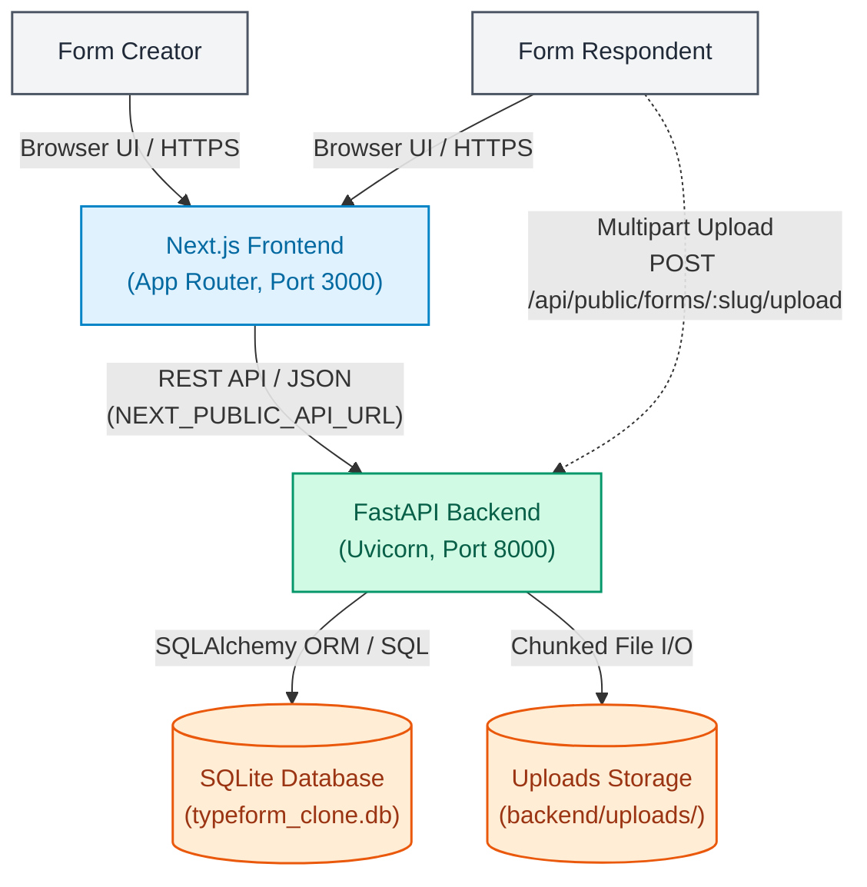

**Key Points:**
- **Creator Communication**: Creators interact with Next.js through browser sessions, communicating with FastAPI via JSON REST endpoints.
- **Respondent Flow**: Respondents interact through public Next.js URLs (`/f/[slug]`) and submit multipart binary payloads directly to backend endpoints with rate limiting and file sanitization.
- **Data & File Boundaries**: Application data lives in `typeform_clone.db` managed by SQLAlchemy ORM, while physical files reside in `backend/uploads/` with UUID-isolated paths.

*Where in code: [backend/app/main.py](file:///Users/shubhamsharma/Desktop/Scaler/backend/app/main.py), [backend/app/database.py](file:///Users/shubhamsharma/Desktop/Scaler/backend/app/database.py), [backend/app/routers/public.py](file:///Users/shubhamsharma/Desktop/Scaler/backend/app/routers/public.py), [backend/app/services/upload_service.py](file:///Users/shubhamsharma/Desktop/Scaler/backend/app/services/upload_service.py), [frontend/src/lib/api.ts](file:///Users/shubhamsharma/Desktop/Scaler/frontend/src/lib/api.ts)*

---

#### 2. Deployment Architecture Diagram

The deployment model demonstrates how the frontend and backend are hosted independently on production PaaS providers (Vercel and Render), linked by environment-configured network bindings. Automated GitHub continuous deployment pipelines ensure that changes pushed to the `main` branch trigger immediate builds and deployments across both tiers.

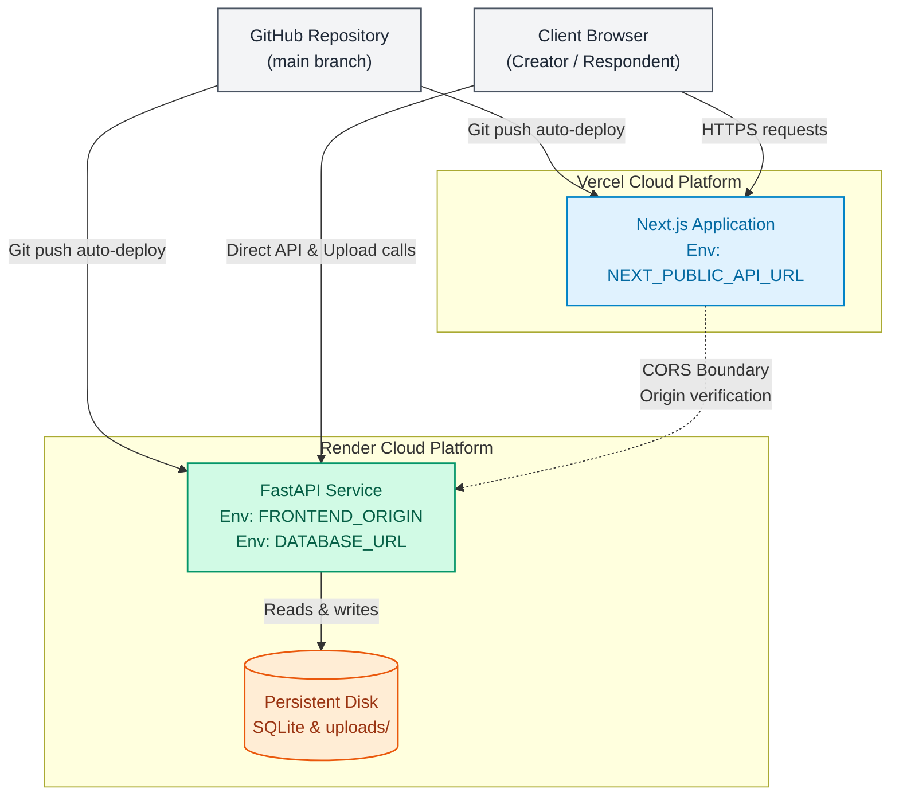

**Key Points:**
- **Vercel Edge & Frontend**: Next.js App Router runs on Vercel, utilizing `NEXT_PUBLIC_API_URL` to route client queries and server-rendered form lookups to the backend.
- **Render Backend & CORS**: FastAPI runs as a Python web service on Render, enforcing strict CORS origin filtering via `FRONTEND_ORIGIN` inside `CORSMiddleware`.
- **Persistent Storage**: SQLite database file and uploaded files reside on persistent volume mounts, isolating physical storage from web container restarts.

*Where in code: [backend/app/main.py](file:///Users/shubhamsharma/Desktop/Scaler/backend/app/main.py#L62-L82), [frontend/src/lib/api.ts](file:///Users/shubhamsharma/Desktop/Scaler/frontend/src/lib/api.ts#L10-L15), [backend/.env.example](file:///Users/shubhamsharma/Desktop/Scaler/backend/.env.example)*

---

#### 3. Component Architecture

The Component Architecture diagram maps the major functional modules within the frontend and backend, explicitly illustrating dependency directions. Frontend UI pages delegate data interactions to the centralized API client, which talks to FastAPI route handlers. Routers delegate business logic to domain services, which validate payloads against strict Pydantic schemas and perform atomic ORM operations.

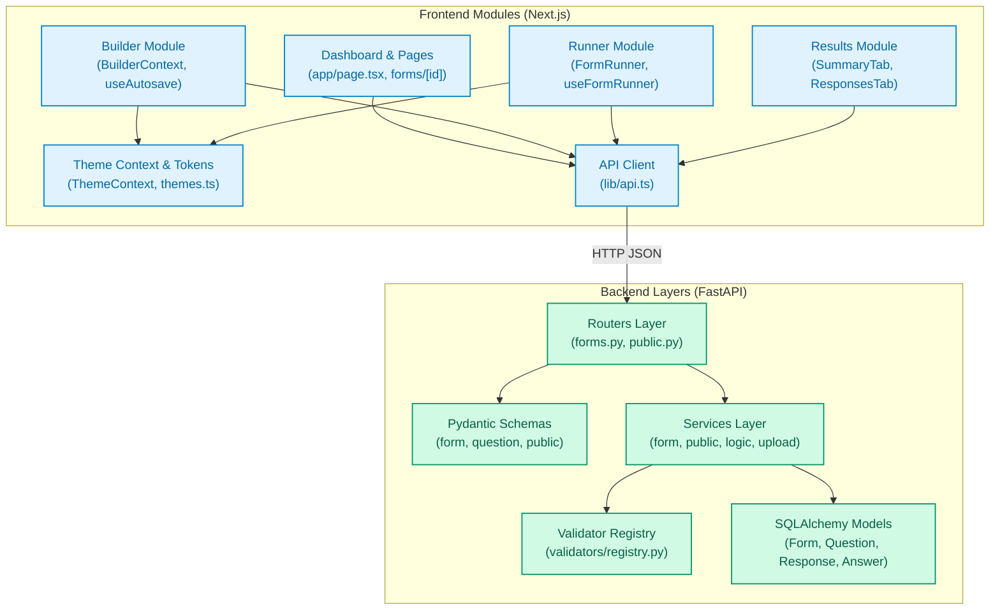

**Key Points:**
- **Strict Layering**: Routers maintain zero business logic; every endpoint delegates directly to a dedicated service function (`form_service`, `public_service`, `response_service`, `upload_service`).
- **Dependency Flow**: Routers depend on Pydantic schemas for request validation and response serialization, and domain services interact with SQLAlchemy ORM models.
- **Client Unification**: All frontend components interact with the backend through strongly typed wrapper functions in `lib/api.ts`.

*Where in code: [frontend/src/lib/api.ts](file:///Users/shubhamsharma/Desktop/Scaler/frontend/src/lib/api.ts), [backend/app/routers/forms.py](file:///Users/shubhamsharma/Desktop/Scaler/backend/app/routers/forms.py), [backend/app/routers/public.py](file:///Users/shubhamsharma/Desktop/Scaler/backend/app/routers/public.py), [backend/app/services/](file:///Users/shubhamsharma/Desktop/Scaler/backend/app/services/), [backend/app/models/](file:///Users/shubhamsharma/Desktop/Scaler/backend/app/models/)*

---

#### 4. Entity-Relationship Model (Database ERD)

The Entity-Relationship Diagram represents the exact physical database schema implemented across SQLAlchemy models in `backend/app/models/`. It captures all primary keys (PK), foreign keys (FK), unique constraints (UK), indices, cascade rules, and column data types across all six tables: `users`, `forms`, `questions`, `responses`, `answers`, and `uploads`.

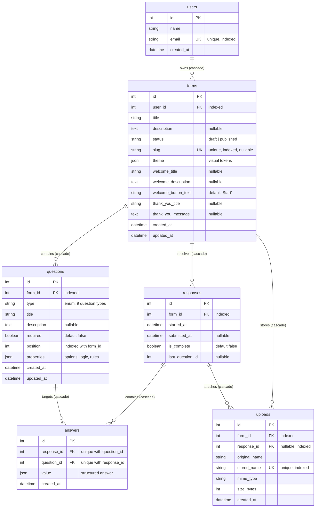

**Key Points:**
- **Cascade Deletion**: Database foreign keys declare `ON DELETE CASCADE` and SQLAlchemy relationships specify `cascade="all, delete-orphan"`, guaranteeing that deleting a form purges all questions, responses, answers, and upload metadata cleanly.
- **Physical File Cleanup**: An SQLAlchemy ORM `@event.listens_for(Upload, "after_delete")` listener automatically deletes physical files from `backend/uploads/` whenever an upload record is removed.
- **Uniqueness & Indexing**: Unique constraints on `users.email`, `forms.slug`, `uploads.stored_name`, and composite `(response_id, question_id)` on `answers` guarantee data integrity and prevent double-answering.

*Where in code: [models/user.py](file:///Users/shubhamsharma/Desktop/Scaler/backend/app/models/user.py), [models/form.py](file:///Users/shubhamsharma/Desktop/Scaler/backend/app/models/form.py), [models/question.py](file:///Users/shubhamsharma/Desktop/Scaler/backend/app/models/question.py), [models/response.py](file:///Users/shubhamsharma/Desktop/Scaler/backend/app/models/response.py), [models/answer.py](file:///Users/shubhamsharma/Desktop/Scaler/backend/app/models/answer.py), [models/upload.py](file:///Users/shubhamsharma/Desktop/Scaler/backend/app/models/upload.py)*

---

#### 5. Key User Journeys

##### 5.1 Creator Journey

This sequence diagram depicts the end-to-end workflow of a form creator creating a form, modifying question parameters, triggering automatic debounced bulk persistence, and publishing the form to generate a public URL.

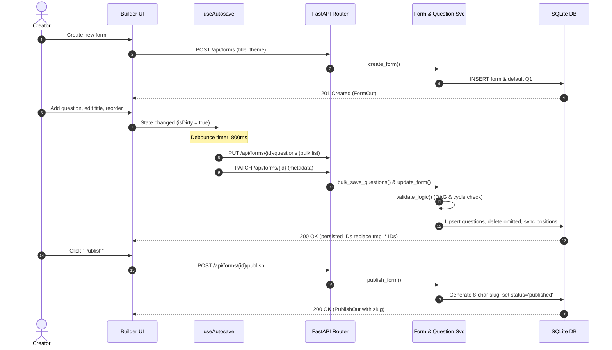

**Key Points:**
- **Debounced Autosave**: Client-side hook `useAutosave` buffers user keystrokes for 800ms before dispatching parallel requests (`PUT /questions` and `PATCH /forms/{id}`).
- **Atomic Bulk Sync**: `question_service.bulk_save_questions` validates conditional logic DAG acyclicity before upserting questions, deleting omitted IDs, and updating zero-based sequential positions in a single transaction.
- **Slug Generation**: First-time publishing generates an 8-character URL-safe random alphanumeric slug (`python-slugify` and cryptographic secrets).

*Where in code: [useAutosave.ts](file:///Users/shubhamsharma/Desktop/Scaler/frontend/src/components/builder/useAutosave.ts), [routers/forms.py](file:///Users/shubhamsharma/Desktop/Scaler/backend/app/routers/forms.py), [form_service.py](file:///Users/shubhamsharma/Desktop/Scaler/backend/app/services/form_service.py), [question_service.py](file:///Users/shubhamsharma/Desktop/Scaler/backend/app/services/question_service.py)*

---

##### 5.2 Respondent Journey

This sequence diagram depicts a respondent loading a public form by slug, starting a session, progressing through questions one by one with drop-off tracking, and submitting responses with server-side validation.

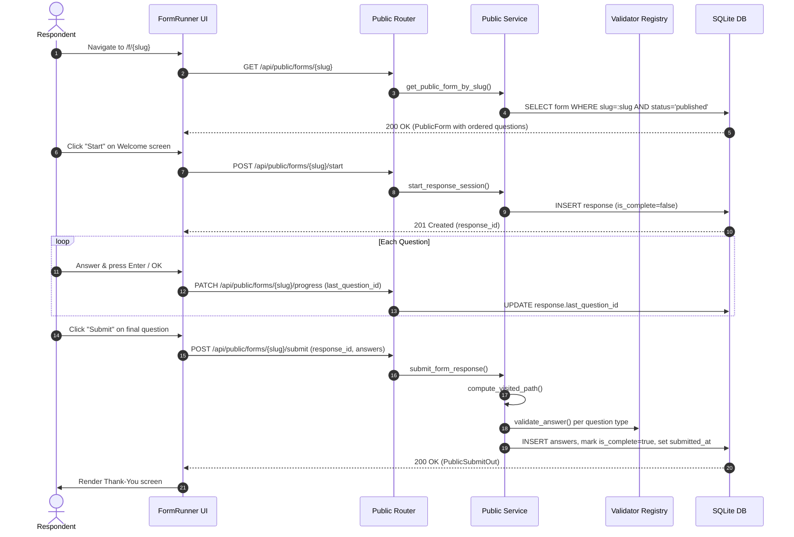

**Key Points:**
- **Published Verification**: Public lookups return HTTP 404 for draft forms or invalid slugs, protecting private draft data.
- **Partial-Response Tracking**: Session start creates an incomplete response record (`is_complete=false`), and every step update records `last_question_id` for accurate funnel drop-off analytics.
- **Path-Aware Validation**: Submissions compute the dynamic visited branch path; only questions on that path are validated, and bypassed questions are rejected if submitted with stale values.

*Where in code: [useFormRunner.ts](file:///Users/shubhamsharma/Desktop/Scaler/frontend/src/components/runner/useFormRunner.ts), [routers/public.py](file:///Users/shubhamsharma/Desktop/Scaler/backend/app/routers/public.py), [public_service.py](file:///Users/shubhamsharma/Desktop/Scaler/backend/app/services/public_service.py), [validators/registry.py](file:///Users/shubhamsharma/Desktop/Scaler/backend/app/validators/registry.py)*

---

##### 5.3 Results and Analytics Journey

This sequence diagram depicts the creator viewing analytics for a published form, navigating from aggregate metrics to individual submissions, and triggering an on-demand CSV export.

```mermaid
sequenceDiagram
    autonumber
    actor Creator as Creator
    participant UI as Results Page
    participant API as Forms Router
    participant Svc as Response Service
    participant DB as SQLite DB

    Creator->>UI: Navigate to /forms/{id}/results
    UI->>API: GET /api/forms/{id}/summary
    API->>Svc: get_form_summary()
    Svc->>DB: Run aggregate queries (completion rate, drop-offs, per-type metrics)
    DB-->>UI: 200 OK (FormSummaryOut)
    UI->>Creator: Render Summary tab with metric cards & drop-off funnel

    Creator->>UI: Click "Responses" tab
    UI->>API: GET /api/forms/{id}/responses?page=1&page_size=20
    API->>Svc: get_form_responses()
    Svc->>DB: Query paginated responses joined with answers
    DB-->>UI: 200 OK (PaginatedResponsesOut)
    UI->>Creator: Display submissions table with answer badges

    Creator->>UI: Click "Download CSV"
    UI->>API: GET /api/forms/{id}/export.csv?status=completed
    API->>Svc: stream_responses_csv()
    Svc->>DB: Fetch completed responses and question titles
    Svc-->>API: Stream UTF-8 BOM CSV rows with formula protection
    API-->>Creator: Download <form-title>-responses-<date>.csv
```

**Key Points:**
- **Aggregated Analytics**: The summary endpoint computes total visits, completed sessions, completion percentage, average duration, drop-off questions, and question-type distribution breakdowns in optimized queries.
- **Paginated Browsing**: Responses are paginated (default 20 per page) with eager-loaded answers to eliminate N+1 queries.
- **Secure CSV Streaming**: Export uses a generator stream with UTF-8 BOM encoding, human-readable option labels, and spreadsheet formula injection sanitization (prefixing `=`, `+`, `-`, `@` with a single quote).

*Where in code: [results/page.tsx](file:///Users/shubhamsharma/Desktop/Scaler/frontend/src/app/forms/%5Bid%5D/results/page.tsx), [routers/forms.py](file:///Users/shubhamsharma/Desktop/Scaler/backend/app/routers/forms.py#L170-L292), [response_service.py](file:///Users/shubhamsharma/Desktop/Scaler/backend/app/services/response_service.py)*

---

#### 6. Key Design Decisions and Trade-offs

| Decision | Alternatives Considered | Why This Decision Was Chosen |
|:---|:---|:---|
| **JSON Properties Column** (`questions.properties`) | Separate tables per question type, Polymorphic Table Inheritance (EAV), single wide table with null columns. | Keeps schema flat and simple. Avoids multi-table joins or migrations when adding question types or tuning settings (choices, min/max bounds, placeholders, conditional logic rules). |
| **Position-Based Ordering** (`questions.position`) | Linked-list pointers (`next_id`), floating-point order keys, database-level `UNIQUE(form_id, position)`. | Simple integer ordering (`ORDER BY position ASC`) with composite index `(form_id, position)`. Omitting unique constraint allows atomic array re-indexing during bulk PUT without transient key collisions. |
| **Atomic Bulk-Save Endpoint** (`PUT /forms/{id}/questions`) | Granular per-question endpoints (`POST /questions`, `PATCH /questions/{id}`, `DELETE /questions/{id}`). | Matches real-time form builder UI semantics. Entire question list is reordered and synced in a single database transaction, replacing temporary client IDs (`tmp_*`) with real IDs atomically. |
| **Separate Responses and Answers Tables** | Single wide row per submission, storing all answers in one JSON blob on `responses.answers`. | Enables partial session tracking (`started_at`, `is_complete`, `last_question_id`) while allowing individual question aggregations, choice counts, and drop-off funnel analytics via relational queries. Unique constraint on `(response_id, question_id)` guarantees one answer per question per session. |
| **No Authentication** (Single Seeded User `id=1`) | JWT authentication, OAuth2 / Auth0, session cookies. | Satisfies assignment requirements with minimal operational complexity. Code cleanly isolates ownership via `current_user: User = Depends(get_current_user)`, making migration to JWT/OAuth a one-file dependency update. |
| **SQLite Database** | PostgreSQL, MySQL, Supabase. | Zero-configuration file database running out-of-the-box locally and in containerized evaluations. Strict `PRAGMA foreign_keys=ON` ensures referential integrity and cascade deletes identical to PostgreSQL. |
| **Validator Strategy Registry** (`registry.py`) | Monolithic if/else chain in router, Pydantic polymorphic payload validators. | Clean open/closed principle. Dict registry maps `QuestionType` to dedicated validator functions, returning normalized values or raising uniform `ValidationError` for clear per-question error dictionaries. |
| **Forward-Only Logic Jumps with DAG Cycle Detection** | Unrestricted backward jumps without checks, complex Petri nets. | Guarantees deterministic, forward-progressing respondent journeys. DFS cycle detection during bulk save catches circular loops (`Q2 -> Q5 -> Q2`) before saving, while runtime visited-path calculation prevents execution loops. |

---

### Part 2: Low-Level Design (LLD)

#### 1. Backend Class Diagram (SQLAlchemy Models)

The Backend Class Diagram documents all SQLAlchemy 2.0 ORM classes defined in `backend/app/models/`, their strongly typed `Mapped[...]` attributes, foreign key references, and relationship declarations.

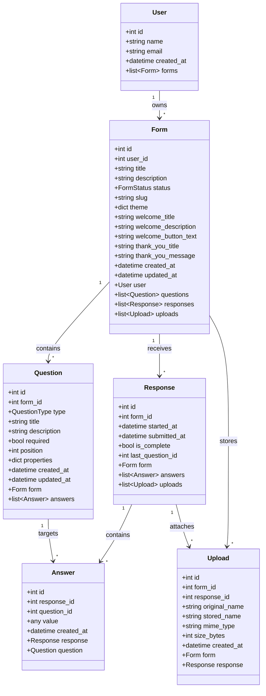

**Key Points:**
- **Explicit ORM Typing**: Models utilize SQLAlchemy 2.0 `Mapped` type annotations with `mapped_column` declarations.
- **Bi-directional Navigation**: All relationships define matching `back_populates` references (`User.forms` <-> `Form.user`, `Form.questions` <-> `Question.form`).
- **Cascade Declarations**: `cascade="all, delete-orphan"` on child collections ensures that deleting an entity purges all child records at the ORM layer.

*Where in code: [models/user.py](file:///Users/shubhamsharma/Desktop/Scaler/backend/app/models/user.py), [models/form.py](file:///Users/shubhamsharma/Desktop/Scaler/backend/app/models/form.py), [models/question.py](file:///Users/shubhamsharma/Desktop/Scaler/backend/app/models/question.py), [models/response.py](file:///Users/shubhamsharma/Desktop/Scaler/backend/app/models/response.py), [models/answer.py](file:///Users/shubhamsharma/Desktop/Scaler/backend/app/models/answer.py), [models/upload.py](file:///Users/shubhamsharma/Desktop/Scaler/backend/app/models/upload.py)*

---

#### 2. Backend Layering and Validator Strategy Pattern

This diagram displays the flow of execution from HTTP routers through the domain services to ORM models. In particular, it illustrates the Strategy Pattern implemented in `validators/registry.py`: `validate_answer` acts as a dynamic dispatcher, looking up the appropriate question-type validator function from a registered strategy map.

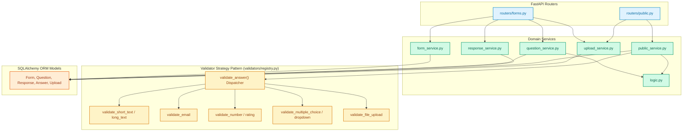

**Key Points:**
- **Thin Routers**: Router files contain only HTTP concerns (path params, status codes, query params, dependency injection).
- **Strategy Pattern**: `VALIDATORS: dict[QuestionType, Callable]` maps each question type to its specific validation algorithm.
- **Normalization**: Validators normalize values (e.g., lowercasing emails, converting numeric floats to ints when whole, mapping choice labels to IDs).

*Where in code: [routers/forms.py](file:///Users/shubhamsharma/Desktop/Scaler/backend/app/routers/forms.py), [routers/public.py](file:///Users/shubhamsharma/Desktop/Scaler/backend/app/routers/public.py), [validators/registry.py](file:///Users/shubhamsharma/Desktop/Scaler/backend/app/validators/registry.py), [services/](file:///Users/shubhamsharma/Desktop/Scaler/backend/app/services/)*

---

#### 3. Public Submission Processing Pipeline

This flowchart outlines the exact order of operations performed by `public_service.submit_form_response` when processing a respondent's submission payload.

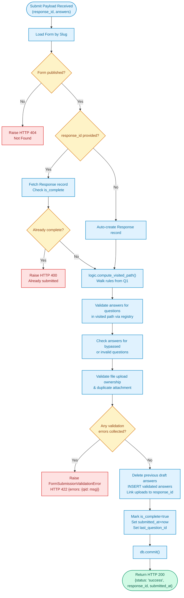

**Key Points:**
- **Double Submission Guard**: Prevents re-submitting an already completed session by checking `response.is_complete` and returning HTTP 400.
- **Dynamic Visited Path**: Questions skipped by conditional jumps are neither required nor evaluated. However, if a bypassed question has an answered value, it is rejected with a 422 error.
- **Error Aggregation**: Validation errors are collected into a dictionary keyed by question ID and returned as HTTP 422 `{"errors": {"<qid>": "<error_message>"}}`.

*Where in code: [public_service.py](file:///Users/shubhamsharma/Desktop/Scaler/backend/app/services/public_service.py#L76-L198), [main.py](file:///Users/shubhamsharma/Desktop/Scaler/backend/app/main.py#L38-L50)*

---

#### 4. Conditional Logic and Graph Validation Engine

This diagram illustrates both runtime evaluation of conditional jumps (`next_question`) and compile-time DAG cycle validation (`validate_logic`) as implemented in `services/logic.py`.

```mermaid
flowchart TD
    classDef step fill:#e0f2fe,stroke:#0284c7,stroke-width:1.5px,color:#0369a1;
    classDef decision fill:#fef3c7,stroke:#d97706,stroke-width:1.5px,color:#92400e;
    classDef term fill:#d1fae5,stroke:#059669,stroke-width:1.5px,color:#065f46;
    classDef err fill:#fee2e2,stroke:#dc2626,stroke-width:1.5px,color:#991b1b;

    subgraph EvalFlow["next_question(question, answers, ordered_questions)"]
        EvalStart(["Evaluate Jump for Question"]):::step
        LoopRules["Iterate rules in properties.logic<br/>(Order: first match wins)"]:::step
        RuleMatch{"Condition matches<br/>(all / any)?"}:::decision
        ReturnTarget(["Return rule target_question_id<br/>or 'end'"]):::term

        HasDefault{"logicDefault<br/>defined?"}:::decision
        ReturnDefault(["Return logicDefault target"]):::term
        HasNext{"Next question in<br/>ordered list exists?"}:::decision
        ReturnNext(["Return ordered_questions[idx + 1].id"]):::term
        ReturnEnd(["Return 'end'"]):::term

        EvalStart --> LoopRules --> RuleMatch
        RuleMatch -- Yes --> ReturnTarget
        RuleMatch -- No rules match --> HasDefault
        HasDefault -- Yes --> ReturnDefault
        HasDefault -- No --> HasNext
        HasNext -- Yes --> ReturnNext
        HasNext -- No --> ReturnEnd
    end

    subgraph ValidateFlow["validate_logic(form, questions) Cycle & DAG Check"]
        ValStart(["Bulk Save Validation"]):::step
        CheckProps["Verify operators valid for type<br/>Verify targets exist, reject self-jumps"]:::step
        BuildGraph["Construct directed graph:<br/>rules + logicDefault + sequential edges"]:::step
        RunDFS["DFS Cycle Detection with<br/>recursion stack tracking"]:::step
        HasCycle{"Cycle found in<br/>recursion stack?"}:::decision
        RaiseCycleErr["Raise HTTP 422<br/>'Circular logic path: Q2 -> Q5 -> Q2'"]:::err
        PassDAG(["Logic Graph Valid (Acyclic DAG)"]):::term

        ValStart --> CheckProps --> BuildGraph --> RunDFS --> HasCycle
        HasCycle -- Yes --> RaiseCycleErr
        HasCycle -- No --> PassDAG
    end
```

**Key Points:**
- **First-Match Priority**: Rules are evaluated in array order; the first matching rule triggers the branch jump immediately.
- **Fallthrough Sequence**: If no rule matches, the engine evaluates `logicDefault`. If `logicDefault` is null, it falls through to the next sequential question or terminates with `"end"`.
- **DFS Cycle Detection**: `validate_logic` builds an adjacency list covering all explicit rules, default jumps, and sequential edges, using Depth-First Search with recursion stack tracking to detect and reject cycles before database writes.

*Where in code: [services/logic.py](file:///Users/shubhamsharma/Desktop/Scaler/backend/app/services/logic.py), [frontend/src/lib/logic.ts](file:///Users/shubhamsharma/Desktop/Scaler/frontend/src/lib/logic.ts)*

---

#### 5. Frontend Form Builder State Machine and Autosave

The Form Builder state machine depicts state transitions inside the `BuilderContext` reducer, tracking dirty state, debounced persistence, and the replacement of temporary client IDs with permanent database IDs upon successful sync.

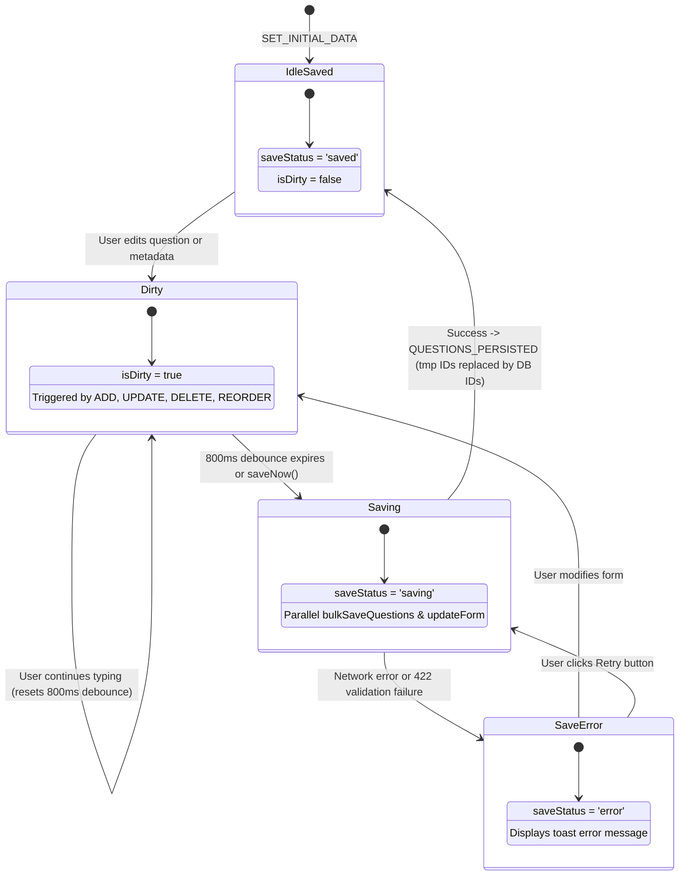

**Key Points:**
- **Zero-Dependency Centralized Store**: Implemented with React's built-in `useReducer` and Context API for predictable, atomic state transitions and zero bundle overhead.
- **Temporary ID Reconciliation**: New client questions receive a temporary ID (e.g. `tmp_1712...`). When `QUESTIONS_PERSISTED` fires, the client replaces temporary IDs with database-generated IDs while maintaining active question selection.
- **Debounced Autosave**: `useAutosave` batches modifications and automatically persists changes after 800ms of inactivity.

*Where in code: [BuilderContext.tsx](file:///Users/shubhamsharma/Desktop/Scaler/frontend/src/components/builder/BuilderContext.tsx), [useAutosave.ts](file:///Users/shubhamsharma/Desktop/Scaler/frontend/src/components/builder/useAutosave.ts)*

---

#### 6. Respondent Runner State Machine and Navigation Stack

This state diagram illustrates the lifecycle of the public respondent runner (`FormRunner.tsx`), detailing keyboard inputs, auto-advance timers, validation error shake animations, and the path history stack.

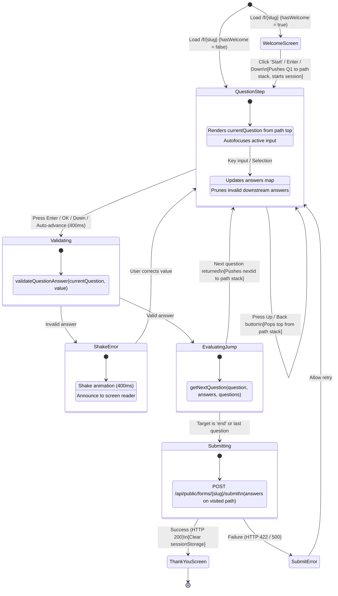

**Key Points:**
- **Path Stack Navigation**: The runner stores visited question IDs in a `path: string[]` stack. Clicking Back or pressing `ArrowUp` pops the top ID, preserving visited order across arbitrary jumps.
- **Downstream Answer Pruning**: When a respondent changes an answer that alters downstream logic jumps, subsequent answers on obsolete branches are pruned.
- **Keyboard Shortcuts**: Supports full keyboard traversal: `Enter`/`ArrowDown` to advance, `ArrowUp` to navigate back, letter keys (A-Z) for multiple-choice selections, number keys for ratings, and Y/N for boolean questions.

*Where in code: [useFormRunner.ts](file:///Users/shubhamsharma/Desktop/Scaler/frontend/src/components/runner/useFormRunner.ts), [FormRunner.tsx](file:///Users/shubhamsharma/Desktop/Scaler/frontend/src/components/runner/FormRunner.tsx)*

---

#### 7. Frontend Component Tree

The Frontend Component Tree illustrates the hierarchy of React components across all four primary routes of the Next.js application: Dashboard (`/`), Builder (`/forms/[id]/edit`), Public Runner (`/f/[slug]`), and Results (`/forms/[id]/results`).

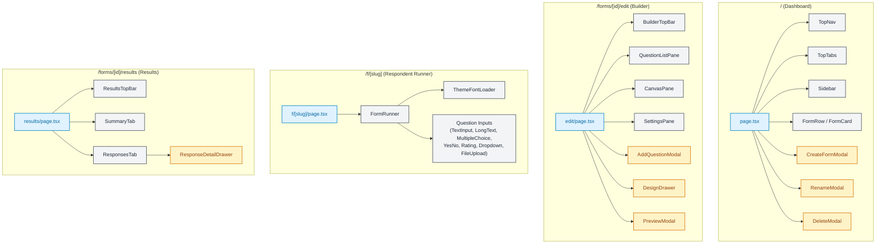

**Key Points:**
- **Page Isolation**: Each primary route encapsulates its state context, layouts, and modals.
- **Specialized Inputs**: Dedicated input components (`TextInput`, `LongTextInput`, `MultipleChoiceInput`, `YesNoInput`, `RatingInput`, `DropdownInput`, `FileUploadInput`) adhere to unified runner interfaces.
- **Modular Drawers**: Details drawers (`ResponseDetailDrawer`, `DesignDrawer`) slide out smoothly without triggering page reloads.

*Where in code: [frontend/src/app/](file:///Users/shubhamsharma/Desktop/Scaler/frontend/src/app/), [frontend/src/components/](file:///Users/shubhamsharma/Desktop/Scaler/frontend/src/components/)*

---

#### 8. Theme and Dark-Mode Isolation Architecture

This diagram demonstrates how creator dark mode (controlled via `<html class="dark">` and semantic CSS variables in `tokens.css`) is strictly decoupled from the respondent form theme using an isolation boundary (`[data-theme-isolated="true"]`).

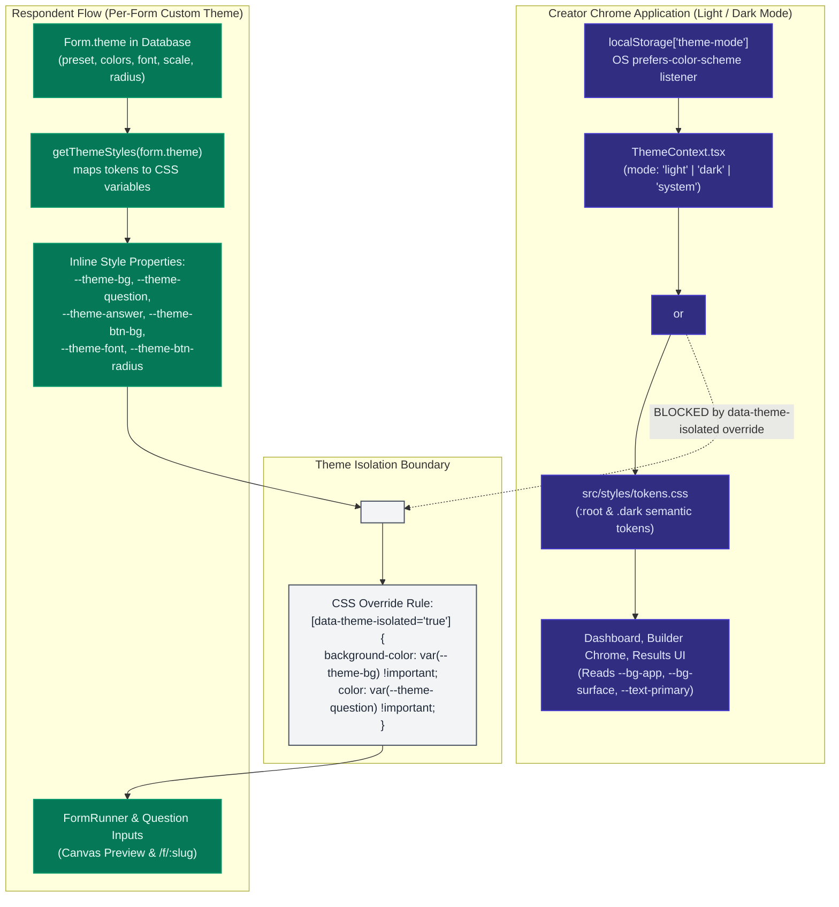

**Key Points:**
- **Creator App Dark Mode**: `ThemeContext.tsx` manages `"light"`, `"dark"`, and `"system"` modes, persisting choices to `localStorage["theme-mode"]` and toggling the `.dark` class on the `<html>` root.
- **Respondent Theme Independence**: Form themes are stored in `forms.theme` and transformed into scoped CSS custom properties (`--theme-bg`, `--theme-question`, `--theme-answer`, `--theme-btn-bg`).
- **Isolation Boundary**: The attribute `[data-theme-isolated="true"]` resets background and text colors with `!important` declarations, ensuring that public forms and the builder canvas render identically regardless of the creator's OS or app dark mode preference.

*Where in code: [ThemeContext.tsx](file:///Users/shubhamsharma/Desktop/Scaler/frontend/src/context/ThemeContext.tsx), [themes.ts](file:///Users/shubhamsharma/Desktop/Scaler/frontend/src/lib/themes.ts), [tokens.css](file:///Users/shubhamsharma/Desktop/Scaler/frontend/src/styles/tokens.css#L333-L342), [FormRunner.tsx](file:///Users/shubhamsharma/Desktop/Scaler/frontend/src/components/runner/FormRunner.tsx#L485-L501)*

---

#### 9. Complete API Specification Reference

| Method | Endpoint Path | Router File | Service Function | Request Schema | Response Schema | Auth | Status Codes |
|:---|:---|:---|:---|:---|:---|:---:|:---|
| **GET** | `/api/forms` | `routers/forms.py` | `form_service.list_forms` | *None* | `list[FormListItem]` | None | `200` |
| **POST** | `/api/forms` | `routers/forms.py` | `form_service.create_form` | `FormCreate` | `FormOut` | None | `201` |
| **GET** | `/api/forms/{id}` | `routers/forms.py` | `form_service.get_form_by_id` | *None* | `FormOut` | None | `200`, `404` |
| **PATCH** | `/api/forms/{id}` | `routers/forms.py` | `form_service.update_form` | `FormUpdate` | `FormOut` | None | `200`, `404` |
| **DELETE** | `/api/forms/{id}` | `routers/forms.py` | `form_service.delete_form` | *None* | `MessageOut` | None | `200`, `404` |
| **POST** | `/api/forms/{id}/duplicate` | `routers/forms.py` | `form_service.duplicate_form` | *None* | `FormOut` | None | `201`, `404` |
| **POST** | `/api/forms/{id}/publish` | `routers/forms.py` | `form_service.publish_form` | *None* | `PublishOut` | None | `200`, `404` |
| **POST** | `/api/forms/{id}/unpublish` | `routers/forms.py` | `form_service.unpublish_form` | *None* | `FormOut` | None | `200`, `404` |
| **PUT** | `/api/forms/{id}/questions` | `routers/forms.py` | `question_service.bulk_save_questions` | `list[BulkQuestionItem]` | `list[QuestionOut]` | None | `200`, `400`, `404`, `422` |
| **GET** | `/api/forms/{id}/responses` | `routers/forms.py` | `response_service.get_form_responses` | `page`, `page_size`, `status` | `PaginatedResponsesOut` | None | `200`, `404` |
| **GET** | `/api/forms/{id}/responses/{rid}` | `routers/forms.py` | `response_service.get_response_detail` | *None* | `ResponseDetailOut` | None | `200`, `404` |
| **DELETE** | `/api/forms/{id}/responses/{rid}` | `routers/forms.py` | `response_service.delete_response` | *None* | `MessageOut` | None | `200`, `404` |
| **GET** | `/api/forms/{id}/summary` | `routers/forms.py` | `response_service.get_form_summary` | *None* | `FormSummaryOut` | None | `200`, `404` |
| **GET** | `/api/forms/{id}/export.csv` | `routers/forms.py` | `response_service.stream_responses_csv` | `status` (query) | `StreamingResponse` (text/csv) | None | `200`, `404` |
| **GET** | `/api/forms/{id}/uploads/{upload_id}` | `routers/forms.py` | `upload_service.stream_upload_file` | *None* | `FileResponse` | None (creator) | `200`, `404` |
| **GET** | `/api/public/forms/{slug}` | `routers/public.py` | `public_service.get_public_form_by_slug` | *None* | `PublicFormOut` | None | `200`, `404` |
| **POST** | `/api/public/forms/{slug}/start` | `routers/public.py` | `public_service.start_response_session` | *None* | `StartResponseOut` | None | `201`, `404` |
| **POST** | `/api/public/forms/{slug}/submit` | `routers/public.py` | `public_service.submit_form_response` | `PublicSubmitPayload` | `PublicSubmitOut` | None | `200`, `400`, `404`, `422` |
| **PATCH** | `/api/public/forms/{slug}/progress` | `routers/public.py` | `public_service.record_drop_off_progress` | `ProgressPayload` | `ProgressOut` | None | `200`, `404` |
| **POST** | `/api/public/forms/{slug}/upload` | `routers/public.py` | `upload_service.save_upload` | Multipart: `file`, `question_id` | `UploadOut` | None | `200`, `400`, `403`, `413`, `422`, `429` |
| **GET** | `/api/health` | `main.py` | Inline `health_check` | *None* | `{"status": "ok", "message": "..."}` | None | `200` |

---

#### 10. Architecture Diagram Artifacts and Validation Status

All 15 Mermaid architecture diagrams are verified for GitHub native rendering. Pre-rendered vector graphics are compiled to SVG format using `@mermaid-js/mermaid-cli` and saved in `docs/diagrams/` as a static visual fallback.

| # | Diagram Identifier | Category | Type | Exported Artifact | Syntax Status |
|:---:|:---|:---:|:---:|:---|:---:|
| 1 | `hld_system_context` | HLD | `flowchart` | [`docs/diagrams/hld_system_context.svg`](docs/diagrams/hld_system_context.svg) | ✅ Valid |
| 2 | `hld_deployment` | HLD | `flowchart` | [`docs/diagrams/hld_deployment.svg`](docs/diagrams/hld_deployment.svg) | ✅ Valid |
| 3 | `hld_component_architecture` | HLD | `flowchart` | [`docs/diagrams/hld_component_architecture.svg`](docs/diagrams/hld_component_architecture.svg) | ✅ Valid |
| 4 | `hld_entity_relationship` | HLD | `erDiagram` | [`docs/diagrams/hld_entity_relationship.svg`](docs/diagrams/hld_entity_relationship.svg) | ✅ Valid |
| 5 | `hld_seq_creator` | HLD | `sequenceDiagram` | [`docs/diagrams/hld_seq_creator.svg`](docs/diagrams/hld_seq_creator.svg) | ✅ Valid |
| 6 | `hld_seq_respondent` | HLD | `sequenceDiagram` | [`docs/diagrams/hld_seq_respondent.svg`](docs/diagrams/hld_seq_respondent.svg) | ✅ Valid |
| 7 | `hld_seq_results` | HLD | `sequenceDiagram` | [`docs/diagrams/hld_seq_results.svg`](docs/diagrams/hld_seq_results.svg) | ✅ Valid |
| 8 | `lld_backend_models` | LLD | `classDiagram` | [`docs/diagrams/lld_backend_models.svg`](docs/diagrams/lld_backend_models.svg) | ✅ Valid |
| 9 | `lld_backend_layering` | LLD | `flowchart` | [`docs/diagrams/lld_backend_layering.svg`](docs/diagrams/lld_backend_layering.svg) | ✅ Valid |
| 10 | `lld_public_submit_flow` | LLD | `flowchart` | [`docs/diagrams/lld_public_submit_flow.svg`](docs/diagrams/lld_public_submit_flow.svg) | ✅ Valid |
| 11 | `lld_logic_engine` | LLD | `flowchart` | [`docs/diagrams/lld_logic_engine.svg`](docs/diagrams/lld_logic_engine.svg) | ✅ Valid |
| 12 | `lld_frontend_builder_state` | LLD | `stateDiagram-v2` | [`docs/diagrams/lld_frontend_builder_state.svg`](docs/diagrams/lld_frontend_builder_state.svg) | ✅ Valid |
| 13 | `lld_respondent_state_machine` | LLD | `stateDiagram-v2` | [`docs/diagrams/lld_respondent_state_machine.svg`](docs/diagrams/lld_respondent_state_machine.svg) | ✅ Valid |
| 14 | `lld_frontend_component_tree` | LLD | `flowchart` | [`docs/diagrams/lld_frontend_component_tree.svg`](docs/diagrams/lld_frontend_component_tree.svg) | ✅ Valid |
| 15 | `lld_theme_isolation` | LLD | `flowchart` | [`docs/diagrams/lld_theme_isolation.svg`](docs/diagrams/lld_theme_isolation.svg) | ✅ Valid |

> [!NOTE]
> **Diagram Images Fallback**: If viewing this repository on a Markdown reader that does not render Mermaid blocks natively, open the pre-rendered SVG files directly in the [`docs/diagrams/`](docs/diagrams/) directory.

---

### Repository Structure

```
.
├── backend/                   # FastAPI application & SQLite database
│   ├── app/
│   │   ├── main.py            # App entry point, CORS middleware, exception handlers
│   │   ├── database.py        # SQLAlchemy engine, SessionLocal, Base declarative class
│   │   ├── dependencies.py    # Request dependencies (get_current_user)
│   │   ├── models/            # SQLAlchemy 2.0 ORM models
│   │   │   ├── answer.py      # Answer model with unique (response_id, question_id)
│   │   │   ├── enums.py       # FormStatus and QuestionType string enums
│   │   │   ├── form.py        # Form model with theme JSON and welcome/thank-you fields
│   │   │   ├── question.py    # Question model with properties JSON and position index
│   │   │   ├── response.py    # Response session model for drop-off tracking
│   │   │   ├── upload.py      # Upload model with physical file cleanup hook
│   │   │   └── user.py        # User creator model
│   │   ├── routers/           # FastAPI thin route handlers
│   │   │   ├── forms.py       # Creator form CRUD, bulk questions, responses, export
│   │   │   ├── public.py      # Public respondent endpoints (load, start, progress, submit)
│   │   │   ├── questions.py   # Questions router module
│   │   │   └── responses.py   # Responses router module
│   │   ├── schemas/           # Pydantic v2 validation schemas
│   │   │   ├── form.py        # FormCreate, FormUpdate, FormOut, PublishOut
│   │   │   ├── public.py      # PublicFormOut, PublicSubmitPayload, ProgressPayload
│   │   │   ├── question.py    # BulkQuestionItem, QuestionOut
│   │   │   ├── response.py    # PaginatedResponsesOut, ResponseDetailOut
│   │   │   ├── summary.py     # FormSummaryOut, metrics and drop-off schemas
│   │   │   ├── theme.py       # FormTheme schema
│   │   │   └── upload.py      # UploadOut schema
│   │   ├── services/          # Domain business logic
│   │   │   ├── form_service.py       # Form CRUD, slug generation, duplicate, publish
│   │   │   ├── logic.py              # Conditional jump evaluation & DFS cycle validation
│   │   │   ├── public_service.py     # Response submission & visited path validation
│   │   │   ├── question_service.py   # Atomic bulk save & position indexing
│   │   │   ├── response_service.py   # Analytics aggregation & streaming CSV export
│   │   │   └── upload_service.py     # Safe file upload, MIME validation & streaming
│   │   ├── validators/        # Question-type answer validation
│   │   │   ├── exceptions.py  # ValidationError definition
│   │   │   └── registry.py    # Strategy pattern mapping QuestionType to validators
│   │   └── seed.py            # Automated seed script creating demo forms & responses
│   ├── pytest.ini             # Pytest test configuration
│   ├── requirements.txt       # Python dependencies
│   ├── tests/                 # Comprehensive test suite (97 tests)
│   └── uploads/               # Local filesystem directory for uploaded attachments
├── docs/                      # Project documentation and visual artifacts
│   ├── design-tokens.md       # Color and styling design tokens documentation
│   └── diagrams/              # Exported vector architecture diagrams (15 SVGs)
└── frontend/                  # Next.js 16 (App Router) web application
    ├── src/
    │   ├── app/               # Next.js App Router pages and layouts
    │   │   ├── f/[slug]/      # Public respondent view (/f/:slug)
    │   │   ├── forms/[id]/    # Creator views: /edit, /results, /share
    │   │   ├── globals.css    # Tailwind CSS v4 entry point and semantic mappings
    │   │   ├── layout.tsx     # Root layout with anti-FOUC theme script
    │   │   ├── page.tsx       # Creator workspace dashboard
    │   │   └── providers.tsx  # React Query & Theme providers
    │   ├── components/        # Reusable React components
    │   │   ├── builder/       # Form builder (Canvas, QuestionList, Settings, Autosave)
    │   │   ├── dashboard/     # Dashboard chrome (Sidebar, TopNav, FormRow, Modals)
    │   │   ├── results/       # Analytics (SummaryTab, ResponsesTab, DetailDrawer)
    │   │   ├── runner/        # Public respondent runner & question type inputs
    │   │   └── ui/            # Reusable UI primitives (Button, Modal, Input, Badge)
    │   ├── context/           # React Context state stores
    │   │   └── ThemeContext.tsx # Creator light/dark/system theme store
    │   ├── lib/               # Utility libraries and API client
    │   │   ├── api.ts         # Unified backend HTTP client
    │   │   ├── logic.ts       # Client-side conditional logic & path calculation
    │   │   ├── themes.ts      # Visual theme tokens & Google Fonts loader
    │   │   └── validation.ts  # Client-side validation mirroring backend rules
    │   ├── styles/
    │   │   └── tokens.css     # Design tokens and theme isolation CSS
    │   └── types/             # Shared TypeScript type definitions
    ├── e2e/                   # Playwright end-to-end test specs
    ├── package.json           # Frontend dependencies and scripts
    ├── playwright.config.ts   # Playwright configuration
    └── tailwind.config.ts     # Tailwind CSS configuration
```

---

## Features Checklist

| Feature | Category | Status | Details |
|---|---|:---:|---|
| **Conditional Logic Jumps** | Bonus | ✅ Done | Typeform-style jumps (`equals`, `not_equals`, `contains`, `greater_than`, `less_than`, `is_answered`, `is_empty`, jump to end, logic default, cycle detection & backward jump prevention, dynamic path stack, non-regressive progress bar, builder visual jump arrows). |
| **Custom Themes** | Bonus | ✅ Done | Custom colors (background, question, answer, button, button text), Google Fonts (`Inter`, `Playfair Display`, `Outfit`, `JetBrains Mono` etc.), font scaling (`small`/`medium`/`large`), button corner radius (`sharp`/`rounded`/`pill`), background image presets & opacity/overlay. Isolated from creator dark mode. |
| **CSV Export** | Bonus | ✅ Done | Streaming CSV export with UTF-8 BOM, metadata headers, completion status filtering, dynamic question titles, formatted answers, and uploaded filenames. |
| **Partial-Response Tracking** | Bonus | ✅ Done | Session lifecycle tracking (`started_at`, `submitted_at`, `is_complete`, `last_question_id`), completion rate percentage, drop-off funnel analytics per question, and average completion duration. |
| **File Upload Question** | Bonus | ✅ Done | Secure multipart file upload with chunked streaming, MIME & extension validation, executable magic-byte inspection, filename sanitization, creator-only download stream, results drawer integration, and automatic cascade cleanup. |
| **Creator App Dark Mode** | Bonus | ✅ Done | Semantic CSS design tokens (`tokens.css`), light/dark/system mode toggle, anti-flash layout script, OS scheme change listener, complete dark styling across creator chrome while keeping public respondent forms strictly isolated. |

---

## Conditional Logic Specification

Logic rules are stored within a question's `properties` column:

```json
{
  "logic": [
    {
      "id": "rule_1712345678901",
      "match": "all",
      "conditions": [
        {
          "operator": "equals",
          "value": "opt_enterprise"
        }
      ],
      "action": {
        "type": "jump",
        "target_question_id": 105
      }
    },
    {
      "id": "rule_1712345678902",
      "match": "all",
      "conditions": [
        {
          "operator": "equals",
          "value": "opt_unqualified"
        }
      ],
      "action": {
        "type": "jump",
        "target_question_id": "end"
      }
    }
  ],
  "logicDefault": 103
}
```

### Fields & Rules
- **`match`**: `"all"` | `"any"` (currently single condition per rule; stored as list for extensible multi-criteria matching).
- **`conditions[].operator`**:
  - Choice / Dropdown / Yes-No: `equals`, `not_equals`, `is_answered`, `is_empty`
  - Multiple Choice: `contains`, `not_contains`, `is_answered`, `is_empty`
  - Number / Rating: `equals`, `not_equals`, `greater_than`, `less_than`, `is_answered`, `is_empty`
  - Text / Long Text / Email: `equals`, `contains`, `is_answered`, `is_empty`
  - File Upload: `is_answered`, `is_empty`
- **`action.target_question_id`**: Either a positive integer question ID or `"end"` (submits form immediately).
- **`logicDefault`**: Target question ID or `"end"` when no rules match (or `null` to advance to the next sequential question).
- **Validation Constraints**: Only forward jumps are permitted; self-jumps and backward jumps are prohibited to guarantee cycle-free execution.

---

## Custom Theme Schema

Themes are saved in `forms.theme` as structured JSON:

```json
{
  "backgroundColor": "#FFFFFF",
  "questionColor": "#191919",
  "answerColor": "#0284C7",
  "buttonColor": "#0284C7",
  "buttonTextColor": "#FFFFFF",
  "fontFamily": "Inter",
  "fontScale": "medium",
  "buttonRadius": "rounded",
  "backgroundImage": "https://images.unsplash.com/photo-1579546929518-9e396f3cc809?auto=format&fit=crop&w=2000&q=80",
  "backgroundBrightness": 0.5
}
```

### Options & Enums
- **`fontFamily`**: `"System Default"`, `"Inter"`, `"Roboto"`, `"Playfair Display"`, `"Outfit"`, `"Space Grotesk"`, `"Plus Jakarta Sans"`, `"Poppins"`, `"Merriweather"`, `"JetBrains Mono"`.
- **`fontScale`**:
  - `"small"`: 0.9x sizing
  - `"medium"`: 1.0x sizing (standard)
  - `"large"`: 1.15x sizing
- **`buttonRadius`**:
  - `"sharp"`: `0px`
  - `"rounded"`: `8px`
  - `"pill"`: `9999px`
- **Theme Isolation**: Forms apply CSS variables (`--theme-bg`, `--theme-question`, `--theme-answer`, `--theme-btn-bg`, `--theme-font`, etc.) inside a scoped `[data-theme-isolated="true"]` boundary to prevent creator dark mode classes from altering respondent designs.

---

## File Upload Question & Storage Limitations

The `file_upload` question type allows respondents to upload attachments with enterprise-grade safety:

### Question Properties
```json
{
  "maxSizeMB": 5,
  "allowedTypes": ["image", "pdf", "doc"]
}
```
- **`maxSizeMB`**: 1 to 10 MB (defaults to 5 MB).
- **`allowedTypes`**: Array containing any combination of `"image"`, `"pdf"`, and `"doc"`.

### Security Protections
1. **Filename Sanitization**: Client-supplied filenames are stripped of directories (`os.path.basename`) and sanitized against path traversal (`../`) attacks. Files are written to disk using a unique UUID v4 filename.
2. **MIME & Extension Double-Check**: Both the HTTP `Content-Type` header and the file extension must match the allowed categories:
   - `image`: `image/jpeg`, `image/png`, `image/gif`, `image/webp`, `image/svg+xml` (`.jpg`, `.jpeg`, `.png`, `.gif`, `.webp`, `.svg`)
   - `pdf`: `application/pdf` (`.pdf`)
   - `doc`: `.doc`, `.docx`, `.txt`, `.csv`, `.xls`, `.xlsx`
3. **Magic-Byte Anti-Spoofing**: Inspects the initial bytes of incoming streams to reject spoofed executable payloads (such as Windows PE `MZ`, Linux ELF `\x7fELF`, and Mach-O).
4. **Draft Protection & Rate Limiting**: Uploads to unpublished forms return HTTP 403. Public uploads are throttled to 60 requests per minute per IP address.
5. **Access Control**: Public respondents can never download or browse stored files. File downloads (`GET /api/forms/{id}/uploads/{upload_id}`) strictly require creator authentication and form ownership verification.
6. **Cascade Cleanup**: When a response or form is deleted, physical files in `backend/uploads/` are purged immediately via SQLAlchemy event hooks.

> [!NOTE]
> **Ephemeral Disk Notice**: Free hosting platforms (such as Render, Railway, Fly.io, or Heroku free dynos) use ephemeral filesystem disks. Files stored in local directories like `backend/uploads/` are wiped upon container restarts or redeployments. For persistent multi-instance production environments, an S3-compatible object store (e.g., AWS S3, Cloudflare R2) should be configured.

---

## Assumptions

1. **No authentication** — A single default creator (id=1) is seeded at startup.
2. **SQLite** — Used for simplicity; swapping for PostgreSQL requires only changing `DATABASE_URL`.
3. **One question per screen** — Like Typeform, the respondent view shows one question at a time.
4. **Local File Storage** — Files are saved locally to disk under `backend/uploads/` with ephemeral hosting considerations noted above.
5. **Slug is auto-generated** from the form title using `python-slugify`.
