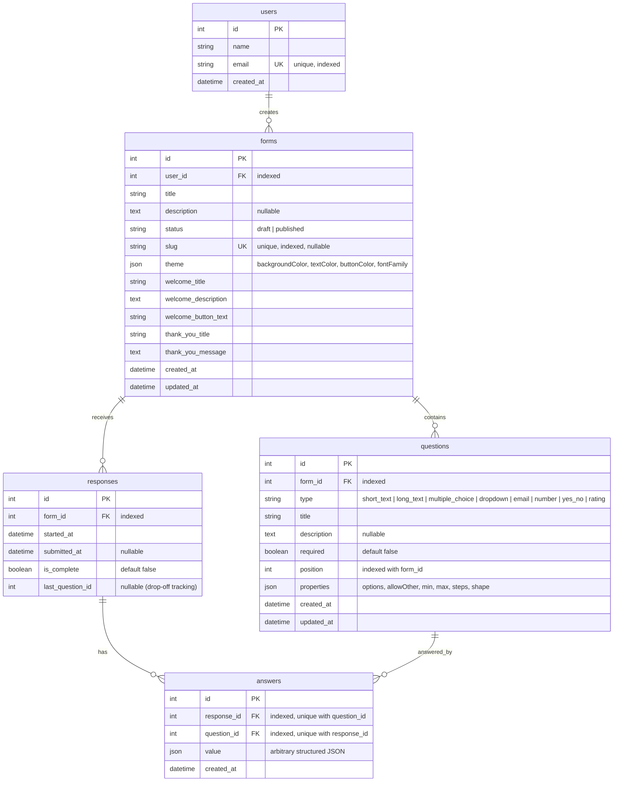

# Typeform Clone — Monorepo

A full-stack Typeform-inspired form builder for a full-stack assignment.

---

## Setup

### Backend

```bash
cd backend
python -m venv .venv
source .venv/bin/activate        # Windows: .venv\Scripts\activate
pip install -r requirements.txt
cp .env.example .env
uvicorn app.main:app --reload
```

API docs available at: http://localhost:8000/docs  
Health check: http://localhost:8000/api/health

### Frontend

```bash
cd frontend
cp .env.example .env.local
npm install
npm run dev
```

App available at: http://localhost:3000

---

## Tech Stack

| Layer     | Technology                                      |
|-----------|-------------------------------------------------|
| Frontend  | Next.js 14 (App Router), TypeScript, Tailwind   |
| Backend   | Python FastAPI, SQLAlchemy 2.0, Pydantic v2     |
| Database  | SQLite (via SQLAlchemy)                         |
| DnD       | @dnd-kit/core, @dnd-kit/sortable                |
| Animation | framer-motion                                   |
| Toasts    | sonner                                          |
| Fetching  | @tanstack/react-query                           |
| Icons     | lucide-react                                    |

---

## Architecture

```
Scaler/
├── frontend/                  # Next.js App Router
│   └── src/
│       ├── app/               # Pages and layouts
│       ├── components/        # Reusable UI components
│       ├── hooks/             # Custom React hooks
│       ├── lib/               # API client, utilities
│       └── types/             # TypeScript type definitions
│
└── backend/                   # FastAPI application
    └── app/
        ├── main.py            # App entry point, CORS, router registration
        ├── database.py        # Engine, SessionLocal, Base, get_db
        ├── models/            # SQLAlchemy ORM models
        ├── schemas/           # Pydantic v2 request/response schemas
        ├── routers/           # FastAPI route handlers (thin layer)
        ├── services/          # Business logic (called by routers)
        ├── validators/        # Answer validation logic per question type
        └── seed.py            # Seeds default creator (id=1)
```

---

## Database Schema



### Design Decisions

- **JSON properties vs per-type tables**: Rather than maintaining 8 distinct tables or relying on polymorphic table inheritance, type-specific configuration (choices for multiple-choice/dropdown, range bounds for ratings/numbers, and placeholders) is stored in a JSON `properties` column. This keeps the schema flat, eliminates multi-table joins when retrieving forms, and allows adding new question types without running database schema migrations.
- **Position-based ordering**: Questions are sequenced using an integer `position` column supported by an index on `(form_id, position)`. A database-level unique constraint on `(form_id, position)` is intentionally omitted because reordering operations (e.g. moving question 5 to position 2) produce transient index collisions that fail mid-operation. The non-unique index ensures high-speed sorting (`ORDER BY position ASC`) while permitting atomic batch reordering.
- **Separate responses and answers tables**: Form submissions are modeled into parent `responses` records and child `answers` records. The `responses` table captures session lifecycle and drop-off analytics (`started_at`, `submitted_at`, `is_complete`, and `last_question_id`), while the `answers` table stores question-specific values. A database unique constraint on `(response_id, question_id)` guarantees one answer per question per session, facilitating both partial-session tracking and per-question metric aggregations.
- **Cascade deletes**: Cascades are enforced concurrently at the database engine level (`ON DELETE CASCADE` foreign keys activated via SQLite `PRAGMA foreign_keys=ON`) and the ORM level (`cascade="all, delete-orphan"` on SQLAlchemy relationships). Deleting a form seamlessly cleans up all dependent questions, responses, and answers without creating orphan rows.

---

## API Overview

### Creator Endpoints (`/api/forms`)
| Method | Path | Description |
|--------|------|-------------|
| GET | `/api/forms` | List all forms with status, question_count, response_count, updated_at |
| POST | `/api/forms` | Create a form (default title, theme, auto-created starter question) |
| GET | `/api/forms/{id}` | Get form with ordered questions |
| PATCH | `/api/forms/{id}` | Partial update (title, theme, welcome/thank-you screens) |
| DELETE | `/api/forms/{id}` | Delete form (cascades to questions, responses, answers) |
| POST | `/api/forms/{id}/duplicate` | Deep copy form + questions (draft status, no responses) |
| POST | `/api/forms/{id}/publish` | Publish form & generate unique 8-character slug |
| POST | `/api/forms/{id}/unpublish` | Revert published form to draft status |
| PUT | `/api/forms/{id}/questions` | Bulk save & reorder questions atomically |
| GET | `/api/forms/{id}/responses` | Paginated response submissions (newest first) |
| GET | `/api/forms/{id}/responses/{rid}` | Single response with answers joined to question titles |
| DELETE | `/api/forms/{id}/responses/{rid}` | Delete individual response session |
| GET | `/api/forms/{id}/summary` | Aggregate analytics (rates, drop-offs, per-type metrics) |
| GET | `/api/forms/{id}/export.csv` | Export all responses as CSV file download |

### Public & Health Endpoints
| Method | Path | Description |
|--------|------|-------------|
| GET | `/api/health` | Liveness check |
| GET | `/api/public/forms/{slug}` | Fetch published form metadata and questions (respondent view) |
| POST | `/api/public/forms/{slug}/start` | Start response session (returns response_id) |
| POST | `/api/public/forms/{slug}/submit` | Submit answers with server-side validation (returns 422 errors per question on failure) |
| PATCH | `/api/public/forms/{slug}/progress` | Record last_question_id for drop-off funnel analytics |

---

## Assumptions

1. **No authentication** — A single default creator (id=1) is seeded at startup.
2. **SQLite** — Used for simplicity; swapping for PostgreSQL requires only changing `DATABASE_URL`.
3. **One question per screen** — Like Typeform, the respondent view shows one question at a time.
4. **No file uploads** — Out of scope for this assignment.
5. **Slug is auto-generated** from the form title using `python-slugify`.
